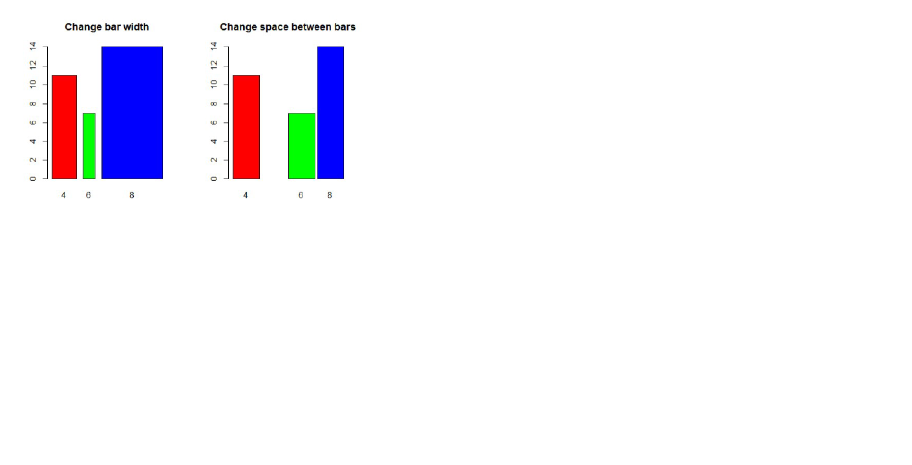

```{r setup, include=FALSE}
knitr::opts_chunk$set(echo = TRUE)
```

## R Markdown

This is an R Markdown document. Markdown is a simple formatting syntax for authoring HTML, PDF, and MS Word documents. For more details on using R Markdown see <http://rmarkdown.rstudio.com>.

When you click the **Knit** button a document will be generated that includes both content as well as the output of any embedded R code chunks within the document. You can embed an R code chunk like this:

```{r cars}
summary(cars)
```

## Including Plots

You can also embed plots, for example:

```{r pressure, echo=FALSE}
plot(pressure)
```

Note that the `echo = FALSE` parameter was added to the code chunk to prevent printing of the R code that generated the plot.


```{r}
#3.) 
#start_num <- as.numeric(readline(prompt = "Enter the starting number for the Fibonacci sequence: "))
start_num <- 1
a <- 0
b <- 1

cat("Fibonacci sequence starting from", start_num, "up to 500:\n")

repeat {
  fib <- a + b
  a <- b
  b <- fib
  
  if (fib > 500) {
    break
  }
  
  if (fib >= start_num) {
    cat(fib, "\n")
  }
}

```

```{r}
#4.) 
Number <- seq(28)
Shoe_size <- c(6.5, 9.0, 8.5, 8.5, 10.5, 7.0, 9.5, 9.0, 13.0, 7.5, 10.5, 8.5, 12.0, 10.5, 13.0, 11.5, 8.5, 5.0, 10.0, 6.5, 7.5, 8.5, 10.5, 8.5, 10.5, 11.0, 9.0, 13.0)
length(Shoe_size)
Height <- c(66.0, 68.0, 64.5, 65.0, 70.0, 64.0, 70.0, 71.0, 72.0, 64.0, 74.5, 67.0, 71.0, 71.0, 77.0, 72.0, 59.0, 62.0, 72.0, 66.0, 64.0, 67.0, 73.0, 69.0, 72.0, 70.0, 69.0, 70.0)
length(Height)
Gender <- c("F", "F", "F", "F", "M", "F", "F", "F", "M", "F", "M", "F", "M", "M", "M", "M", "F", "F", "M", "F", "F", "M", "M", "F", "M", "M", "M", "M")
length(Gender)
four_df <- data.frame(Number, Shoe_size, Height, Gender)
four_df
colnames(four_df) <- c("Number", "Shoe Size", "Height", "Gender")
four_df
```

```{r}
#4.) 
#a.) 
#install.packages("openxlsx")
#library(openxlsx)

#write.xlsx(four_df, "Shoe Sizes.xlsx")
```

```{r}
#4.)
#b.)
female_data <- subset(four_df, Gender == "F")
male_data <- subset(four_df, Gender == "M")

# Count the number of observations for each gender
num_females <- nrow(female_data)
num_males <- nrow(male_data)

# Print the results
cat("Number of Female observations:", num_females, "\n")
cat("Number of Male observations:", num_males, "\n")

```

```{r}
#4.) 
#c.) 
gender_counts <- table(Gender)

barplot(gender_counts, 
        main = "Number of Males and Females in Household Data",
        xlab = "Gender",
        ylab = "Count",
        col = c("lightblue", "pink"),
        args.legend = list(x = "topright"))         

```

```{r}
#5.) 
#a.) 
expenses <- c(Food = 60, Electricity = 10, Savings = 5, Miscellaneous = 25)

labels <- c("Food 60%", "Electricity 10%", "Savings 5%", "Miscellanous 25%")
pie(expenses,
    labels = labels,                    
    main = "Monthly Spending of the Dela Cruz Family", 
    col = c("skyblue", "orange", "lightgreen", "pink")
)

```

```{r}
#6.) 
#a.) 
data(iris)

str(iris)
```

```{r}
#6.)
#b.) 
means <- colMeans(iris[, c("Sepal.Length", "Sepal.Width", "Petal.Length", "Petal.Width")])

means

```

```{r}
#6.) 
#c.) 
species_count <- table(iris$Species)

colors <- c("lightblue", "lightgreen", "salmon")

pie(species_count, 
    main = "Species Distribution in Iris Dataset", 
    col = colors, 
    labels = paste(names(species_count), "(", species_count, ")", sep = ""),
    cex = 0.8)
```

```{r}
#6.) 
#d.) 
subset_of_setosa <- subset(iris, Species == "setosa")
subset_of_versicolor <- subset(iris, Species == "versicolor")
subset_of_virginica <- subset(iris, Species == "virginica")

last_six_setosa <- tail(subset_of_setosa, 6)
last_six_versicolor <- tail(subset_of_versicolor, 6)
last_six_virginica <- tail(subset_of_virginica, 6)

print("Last six rows of Setosa:")
print(last_six_setosa)

print("Last six rows of Versicolor:")
print(last_six_versicolor)

print("Last six rows of Virginica:")
print(last_six_virginica)

```

```{r}
#6.) 
#e.) 
colors <- c("setosa" = "lightblue", "versicolor" = "lightgreen", "virginica" = "salmon")


plot(iris$Sepal.Length, iris$Sepal.Width, 
     col = colors[iris$Species],      
     pch = 19,                        
     xlab = "Sepal Length",           
     ylab = "Sepal Width",           
     main = "Iris Dataset",          
     sub = "Sepal Width and Length") 
# Add a legend

```

```{r}
#6.) 
#f.) 
# The scatterplot shows the relationship between one or more variables, in this case, versicolor and virginica have similarities in Sepal Width and Sepal Length in some parts
```

```{r}
#7.) 
#install.packages("readxl")
#library(readxl)

#Alexa_file <- read.xlsx("alexa_file.xlsx")
#Alexa_file
```

```{r}
#7.) 
#a.)
#library(dplyr)
#Alexa_file$variation <- gsub("Black Dot", "White Dot", Alexa_file$variation)

#Alexa_file$variation <- gsub("Black Plus", "White Plus", Alexa_file$variation)

#Alexa_file$variation <- gsub("Black Show", "White Show", Alexa_file$variation)


#Alexa_file$variation <- gsub("Black Spot", "White Spot", Alexa_file$variation)

#view <- Alexa_file %>%
 # group_by(variation) %>%
  #summarize(number = n())

#view
#variations <- view
#
```

```{r}
#7.) 
#b.) 
#save(variations, file = "variations.R.Data")
```

```{r}
#7.) 
#c.) 
#load("variations.R.Data")

#view
Black <- c("Black Dot", "Black Plus", "Black Show", "Black Spot")
black_total <- c(516, 270, 265, 241)

White <- c("White Dot", "White Plus", "White Show", "White Spot")
white_total <- c(184, 78, 85, 109)

Black_Variations <- data.frame(Black, black_total)
White_Variations <- data.frame(White, white_total)

Black_Variations
White_Variations

```


```{r}
library(ggplot2)
data <- data.frame(
  category = rep(c("A", "B", "C"), 2),
  count = c(10, 15, 20, 5, 10, 15),
  group = rep(c("Group 1", "Group 2"), each = 3)
)

Barplot_variations <- data.frame(
                      variations = c("Black Dot", "Black Plus", "Black Show", "Black Spot", "White Dot", "White Plus", "White Show", "White Spot"),
                      values = c(516, 270, 265, 241, 184, 78, 85, 109),
                      group = rep(c("Black Variations", "White Variations"), each = 4)
)


ggplot(Barplot_variations, aes(x = variations, y = values)) +
  geom_bar(stat = "identity") +
  facet_wrap(~ group) +
  labs(title = "Side-by-Side Bar Plots Variations") + theme(axis.text.x = element_text(angle = 90, vjust = 0.5))
```


